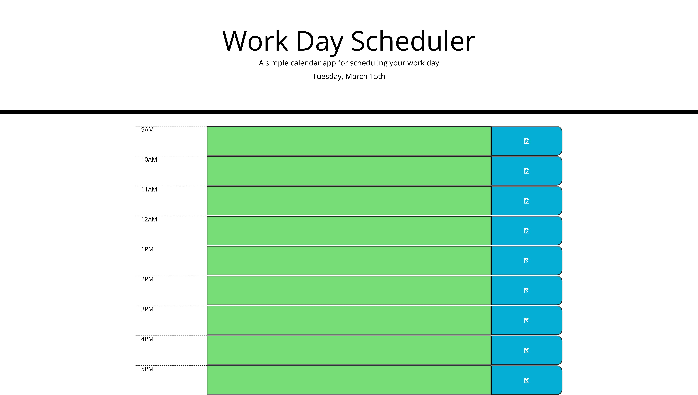

# Day Planner

## Description 
In this project I was given HTML and CSS starter code, my task was to write JavaScript to make it function according to the given criteria. Users can enter text in the blank input fields and when they click a save button on the right side it will save the data they entered to their local storage and have it load back into that field when they reload the page. I used Moment.js to show the current date in the header and to change the background color of the input fields according to the time. If the hour associated with the field has passed it will have grey background, the current hour will show up red, and any future hours are green. 

## Screenshot

## Link
https://matt4292.github.io/day-planner/